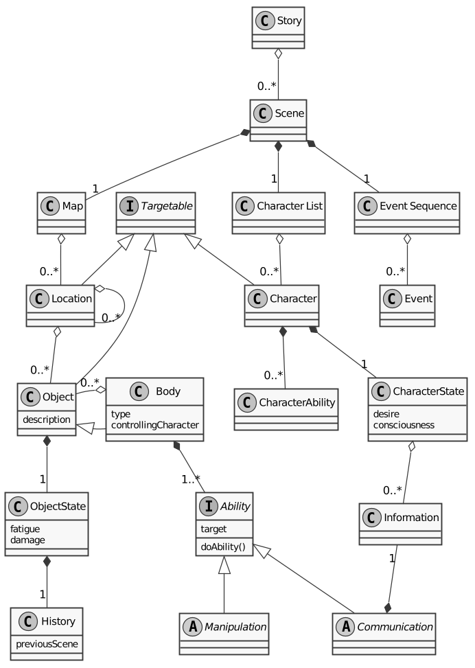

# Opinunanen
Open Integrated Universe Analysis Engine

## Idea
1. Create a universe.
2. Add elements.
3. Analyze.

## Features
* Compose a story of Scenes
* Compose a Scene with a Map of Locations, Objects, 
  Character List of Characters, and Events in a Sequence
* Save and Load of a Story
* Rudimentary Story Render (Terse Text)

## Future Features
* Bodies are Objects with Abilities
* Characters can have Abilities
* Information can flow between Characters and the Map

## Diagram
